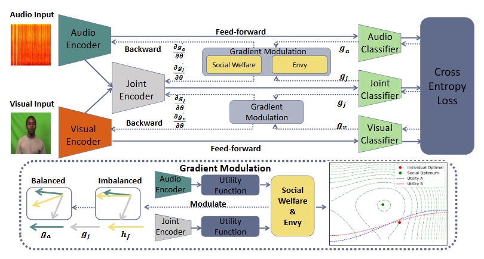

# SOA-GM

## Method Introduction

The illustration of our proposed SOA-GM method, which includes the holo-constraint (social welfare) and mono-constraint (envy). The gradients of the
joint encoder and uni-modal encoder are detached during the backward and are input into our gradient modulation to conduct optimization regarding social
optimum to prevent the imbalanced multimodal issue. The contour figure is the schematic diagram to show the reasonability of the utilized social optimum
strategy compared to the individual utility maximization strategy

## Usage
### Prerequisites
- Python 3.8
- PyTorch 1.9.0
- CUDA 11.4

### Datasets
Change the CREMA-D dataset path of ''av_dataset'' file in line 23-27. You can download the dataset through the following url: [CREMA-D](https://github.com/CheyneyComputerScience/CREMA-D)

### Training
In order to train the model, you can use  
```python
bash SOA-GM.sh 
 ```
in the terminal.

